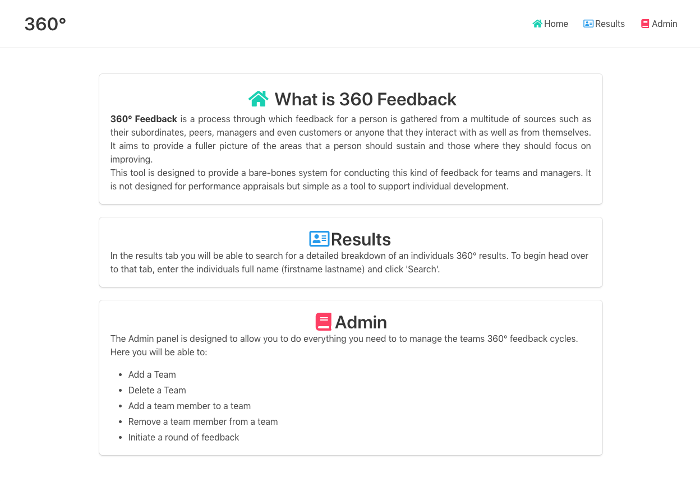

# ThreeSixty

ThreeSixty is designed to be a minimal 360° feedback tool for engineering teams
and managers. It stands on the shoulders of Google App Suite and relies on those
to do all of its heavy lifting:

 - Using google forms to collect feedback data
 - Using google sheets to act as a data store
 - Using google apps scripts to provide the glue

### Setup and Installation

To setup and deply a new version of this application in your own G-Suite perform
the following:

```sh
git clone git@github.com:ALRW/three-sixty.git && cd three-sixty
```

```sh
npm install -g @google/clasp && npm install
```

```sh
clasp login
```

> :warning: At this point you may be asked to enable to google apps script API.
Through the script console. Be aware that once this has been done it can take up
to 24 hours for this change to take affect and the following commands will throw
errors until it is complete.

```sh
clasp create --type webapp
```

Then update your appsscript.json to the following:

```json
{
  "timeZone": "America/New_York",
  "dependencies": {
  },
  "webapp": {
    "access": "MYSELF",
    "executeAs": "USER_DEPLOYING"
  },
  "exceptionLogging": "STACKDRIVER"
}
```

finally to deploy and view your webapp

```sh
clasp push && clasp deploy
```

Before you can use the application you'll need to give it permission to access
certain google resources. First, in your browser of choice, navigate to:
[Google apps scripts](https://script.google.com) and open the `Three-sixty`
project.

Now click on `Run` > `Run function` > `any function is fine` in the navigation
bar. This will open a prompt and ask you to give this script the permissions it
requires.

We can now access our running app by running the following in the command line:

```sh
clasp open --webapp
```

You should now see the following:



If you receive the following error:

```
Missing required parameters: scriptId
```

Then you can open your deployed application by navigating to the
[Google apps scripts](https://script.google.com) page and opening your project
by clicking on `Three-sixty` and then `Open`.

Once the script has opened, navigate to `Publish` > `Deploy as web app` and
copy the url for the currently deployed version of your application. In a new
tab navigate to this url and you should see the current running version of your
360° feedback tool.

### Making this tool your own

This tool intentionally provides the bare minimum to get you started running
360° feedback for your team with an opinionated set of feedback forms. As such
if you are happy with the choices I have made you can go right ahead and not
worry about a thing. However, if you would like to tweak things a little then I
have made certain changes relatively easy to make.

The feedback forms consist of a `Head` -> `Body` -> `Tail`

In most cases it will be the body of the form that will require some changing.
Questions in this section are composed of questions requiring an answer on a
scale that defaults to the following:
```javascript
// namespaces/Constants.ts
const VALUE_MAPPING: { [s: string]: number }  = {
  "Are smashing it": 3,
  "Are spot on": 2,
  "Have room to do more": 1
}
```
If you wish to change the scale, i.e. to increase the number of options or their
descriptors simply update this constant.

> :warning: This must be done when first initialising the application. Once you
> have pushed the application to the app script console all applications will
> use the constant you have defined. Trying to update the const after you have
> been using this tool will cause bad things

Similarly to update the actual questions in the Body of the form head over to
`namespaces/Form.ts` where you can see programmatic representations of feedback
forms for engineers, scrum masters and product owners. The body questions are
generated from a matrix of tuples `[Question/Heading, Helper Text]`. These can
be added deleted and/or updated at will.

